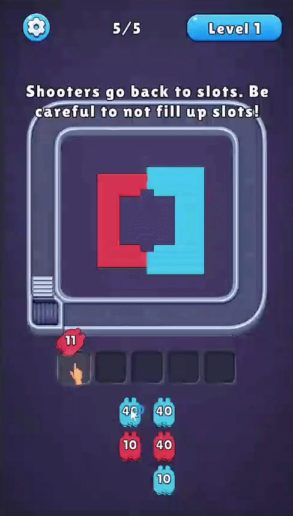

# 🎮 Unity Developer Intern

  <!-- Status Badge -->
  
  <!-- Profile Views -->
  
  <!-- Achievement Badges từ CV -->
  
  
  

  <!-- Social & Portfolio Links -->
  

  

---

## 👋 About Me

Hi, I'm **Phạm Anh Tú**, a Software Engineering student at **FPT University**, specializing in Game Development.

### 🚀 Highlights & Achievements
- 🏆 **2nd Place** — Global Game Jam Vietnam 2026 (Digital Games)
- 🎓 **100% Tuition Scholarship** — FPT University (GPA 3.5 / 4.0)
- 👑 **President** — JS Club Gen 13 (Japanese Software Engineers Club)
- 🌐 **Languages & Certs:** IELTS 6.5 | Basic Japanese | English Proficient  

---

### 🛠 Tech Stack & Tools

| Category | Technologies & Tools |
| :--- | :--- |
| **Languages** |     |
| **Game Engine & Systems** |     |
| **Testing & Quality** |   |
| **Design Patterns** |  -2E8B57?style=for-the-badge)  |
| **Tools & IDEs** |      |

---

### 🚀 Featured Projects

#### 🎮 [Pixel Flow Clone](https://github.com/Kuro1726/PixelFlowClone) | [Playable Build](https://kuro1726.itch.io/pixel-flow-clone)
*2D Hyper-casual Puzzle Game | Personal Project (June 2026 – July 2026)*
- Implemented conveyor movement using **ScriptableObjects** and waypoint tracking with perpendicular **Physics2D raycasts**.
- Optimized runtime instantiation using prewarmed level-aware **Object Pools** for collectors, blocks, audio, and VFX.
- Built **EditMode/PlayMode unit tests** and 100-cycle object-pool stress scenarios using **NUnit**.

  

#### 🥇 [Finask](https://github.com/hvu2005/GameJam2026) | [Playable Build](https://s.jsclub.dev/gamejam2026)
*2D Puzzle Platformer | Global Game Jam 2026 (2nd Place Winner)*
- Built modular prefab-based levels using **Unity Tilemap/Grid** with level-loading pipelines backboned by ScriptableObjects.
- Developed mechanic abilities including **Double Jump, Teleportation,** and **Gravity Inversion**.

#### 🚀 [LuaLander Clone](https://github.com/Kuro1726/LuaLander) | [Playable Build](https://kuro1726.itch.io/lua-lander-clone)
*2D Physics-based Lunar Landing Game | Personal Project (May 2026 – June 2026)*
- Used **C# Events** and an enum-based **FSM** to decouple gameplay, UI, audio, and VFX systems.
- Validated landing physics using **Rigidbody2D** impact velocity and orientation alignment (`Vector2.Dot`).

  

#### 🛠 [j-surviv-SDK](https://github.com/fu-js/j-surviv-SDK) | [Demo Video](https://www.youtube.com/watch?v=Fr8sUA8ilgM)
*Java Bot SDK for Algorithmic Gaming Platform | CodeFest 2025*
- Built a lightweight Java SDK using **Socket.IO, MessagePack, and Gson** for real-time bot communication and state sync.

---

### 📊 GitHub Stats & Coding Activity

  

---

### 🤝 Leadership & Community
- **JS Club President (Gen 13):** Led technical workshops in C#, Web, and Game Dev; organized internal game jams for university members.
